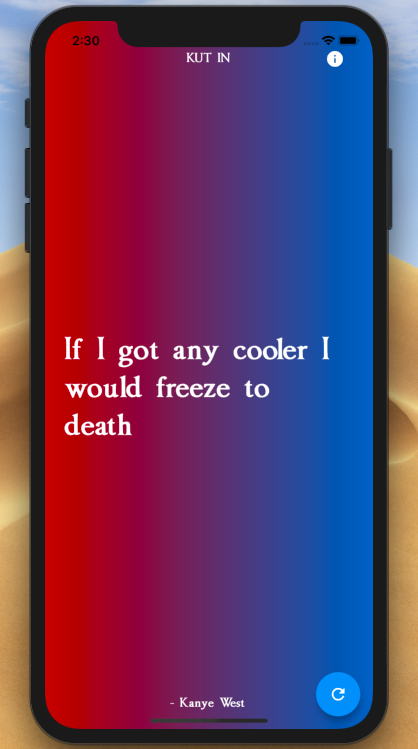
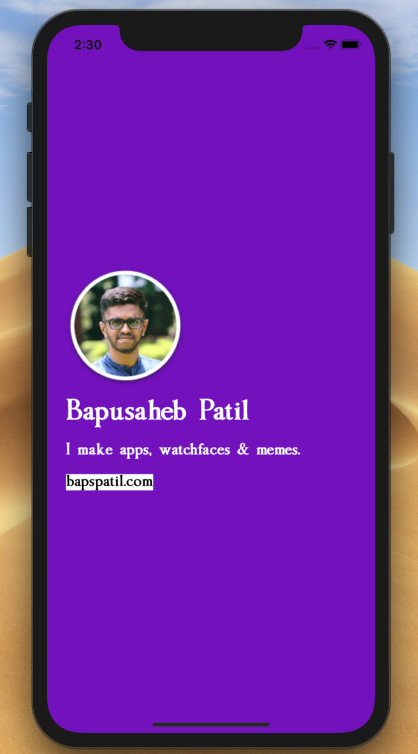

# Kut In

A Flutter app that shows random, wise Kanye West quotes. 😉

**Note**: This app was initially made for #FlutterCreate, a contest by Google that challenges developers to build a beautiful Flutter app using 5KB or less of Dart code. The first version of this app was my submission for the contest. The app will be under development for future enhancements starting April 2019.

Find out more about #FlutterCreate here: https://flutter.dev/create

## Screenshots

&ensp;

## Packages Used

* [http](https://pub.dartlang.org/packages/http)
* [flutter_launcher_icons](https://pub.dartlang.org/packages/flutter_launcher_icons)

## Developed By

Bapusaheb Patil

https://bapspatil.com

## License

    Copyright 2018 Bapusaheb Patil

    Licensed under the Apache License, Version 2.0 (the "License");
    you may not use this file except in compliance with the License.
    You may obtain a copy of the License at

        http://www.apache.org/licenses/LICENSE-2.0

    Unless required by applicable law or agreed to in writing, software
    distributed under the License is distributed on an "AS IS" BASIS,
    WITHOUT WARRANTIES OR CONDITIONS OF ANY KIND, either express or implied.
    See the License for the specific language governing permissions and
    limitations under the License.
